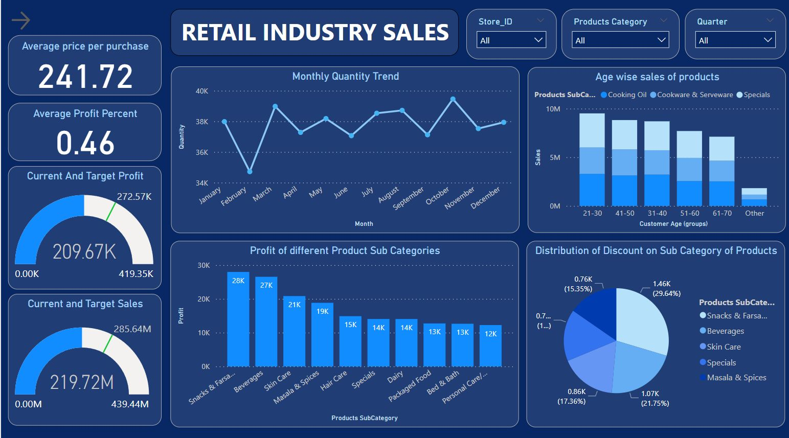
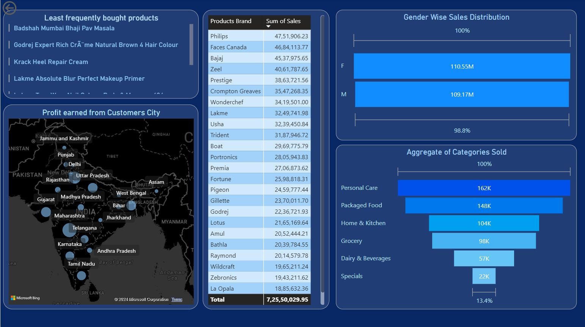

# Power BI Retail Store Dashboard

Developed an advanced Power BI dashboard for a retail store, offering detailed insights into monthly and yearly sales trends,
geographic distribution, gender-specific purchasing patterns, and comprehensive sales and discount analyses. Implemented using
Power BI, DAX (Data Analysis Expressions), and advanced data modeling techniques. Empowered stakeholders with actionable insights
for strategic decision-making based on a deep understanding of sales dynamics and customer behavior.

## :octocat:Dashboard👇

### Page 1

 
 

### Page 2

### 
Don't forget to leave a star ⭐️

### 
And please follow me too 🙇‍♂️

